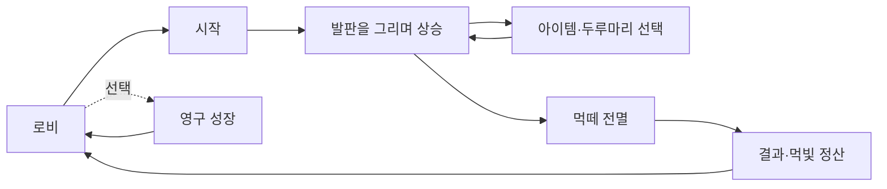

# 먹점프 (MukJump)

> **선 하나가 발판이 되고, 발판 하나가 그림이 된다.**

먹점프는 자동으로 뛰는 작은 먹방울을 위해 직접 발판을 그리는 **세로형 수묵 드로잉 클라이밍 게임**입니다.
캐릭터를 조종하는 대신 붓 한 획의 위치·기울기·길이로 다음 점프를 설계하고, 먹떼를 모아 더 높은 산수화 세계에 도전합니다.

`Unity 6000.3.10f1` · `URP 2D` · `Android` · `9:16 Portrait`

NHN NAN 2026 Game × AI Hackathon · Team-Swooord

## 게임 한눈에 보기

| 항목 | 설명 |
|---|---|
| 장르 | 캐주얼 아케이드 · 드로잉 플랫포머 · 반복 도전 |
| 목표 | 먹방울을 최대한 높이 올려 최고 고도를 갱신하기 |
| 핵심 조작 | 화면에 선을 그어 임시 발판 만들기 |
| 캐릭터 | 약 1초 주기로 자동 점프하며 직접 이동 조작은 하지 않음 |
| 점수 | 한 번의 도전에서 도달한 최고 높이 |
| 성장 | 게임 밖 **영구 성장**과 현재 판만 유지되는 **두루마리 증강** |
| 아트 방향 | 한지, 먹 번짐, 갈필과 제한된 낙관색을 사용한 한국 수묵화 스타일 |

## 플레이 방법

1. 로비에서 `시작`을 누르면 먹방울이 자동으로 점프합니다.
2. 착지할 위치를 예상해 화면에 손가락으로 선을 그립니다.
3. 발판의 **기울기**는 점프 방향을, **길이**는 점프 힘을 바꿉니다.
4. 먹 자원을 관리하며 다음 발판을 이어 그리고 아이템을 획득합니다.
5. 장애물과 바람을 넘고 살아 있는 먹방울을 지키며 최고 고도를 갱신합니다.

**관찰 → 한 획 그리기 → 자동 점프 → 아이템·위험 대응 → 더 높은 곳에 다시 그리기**

### 조작

| 상황 | 조작 |
|---|---|
| 발판 생성 | 플레이 영역을 누른 채 드래그한 뒤 손을 떼기 |
| 메뉴·증강 선택 | 원하는 버튼 또는 카드를 탭하기 |
| 일시정지 | 플레이 화면 오른쪽 위의 쉼 버튼 탭하기 |
| 재도전 | 결과 화면을 확인한 뒤 로비에서 다시 시작하기 |

> 먹방울의 좌우 이동이나 점프 버튼은 없습니다. **어디에 어떤 선을 그을지**가 곧 조작입니다.

## 핵심 시스템

### 그린 선이 실제 발판이 됩니다

- 입력한 선은 부드럽게 정리된 뒤 갈필 질감과 충돌 판정을 가진 발판으로 완성됩니다.
- 대각선 발판에도 몸이 맞춰 붙으며, 표면 방향에 따라 다음 점프 궤적이 달라집니다.
- 발판은 일정 시간이 지나면 먹이 마르듯 사라지고, 동시에 유지할 수 있는 수도 제한됩니다.
- 붓질에는 공용 먹이 필요합니다. 무작정 길게 긋기보다 필요한 만큼 정확히 그리는 편이 유리합니다.

### 한 마리가 아닌 ‘먹떼’를 살립니다

- `먹분신`을 획득할 때마다 먹방울이 한 마리 늘어납니다.
- 분신 하나가 죽어도 다른 먹방울이 살아 있으면 도전은 계속됩니다.
- 각 먹방울은 기본 내구 3칸을 가지며, 피해를 받을수록 몸이 조금씩 부풉니다.
- 마지막 먹방울까지 사라지거나 화면 아래로 추락하면 해당 도전이 끝납니다.

### 높아질수록 세계와 규칙이 달라집니다

- 첫 30m는 발판 그리기와 먹분신을 익히는 입문 구간입니다.
- 이후 이동 먹가시, 낙묵석, 어린 동양 용과 먹해태 같은 수묵 장애물이 차례로 등장합니다.
- 풍향은 천천히 바뀌며 캐릭터의 수평 이동에 영향을 줍니다. 때로는 상승기류가 낙하를 잠시 늦춥니다.
- 고도에 따라 산길·능선·먹비 계곡·검은 절벽을 지나 우주와 수묵이 섞인 무한 구간으로 이어집니다.

## 아이템

| 아이템 | 효과 |
|---|---|
| 먹물방울 | 살아 있는 먹떼 전체가 50m 상승하고 상승 중 장애물 피해를 받지 않음 |
| 황금 붓 | 8초 동안 먹 소모 없이 발판을 그림 |
| 먹 방어막 | 장애물 피해 또는 화면 하단 추락을 1회 막음 |
| 먹분신 | 먹방울 한 마리를 추가함. 동시에 살아 있을 수 있는 먹방울은 최대 24마리 |
| 붓 여유 | 현재 최대 먹의 35%만큼 초과 먹을 누적함. 초과분은 자연 회복되지 않음 |

## 두 가지 성장

| 구분 | 영구 성장 | 두루마리 증강 |
|---|---|---|
| 시점 | 로비의 `성장` 화면 | 플레이 중 정해진 고도 |
| 재화·획득 | 도전 결과로 얻는 `먹빛` | 세 장 중 한 장을 즉시 선택 |
| 유지 기간 | 게임을 종료해도 저장 | 현재 도전이 끝나면 초기화 |
| 구성 | 생존·도약·먹 운용 3계보, 총 39개 열매 | 내구·점프·먹·발판·아이템 운을 바꾸는 8종 |
| 핵심 선택 | 계보별 비기 3개 중 하나를 장착 | 현재 상황에 맞는 효과를 조합 |

영구 성장은 공통 줄기에서 시작해 세 계보로 갈라지는 큰 먹나무입니다. 모든 열매의 해금 비용은 먹빛 1개이며, 일반 열매는 항상 적용되고 강력한 비기는 계보마다 하나만 활성화할 수 있습니다.

두루마리 증강은 `25m → 50m → 100m → 200m → 400m`, 이후 200m마다 확정적으로 등장합니다. 선택한 효과는 이번 판에만 적용되므로 매 도전마다 다른 빌드를 만들 수 있습니다.

## 한 판의 흐름



## 프로젝트에서 바로 실행하기

### 요구 환경

- Unity **6000.3.10f1**
- Universal Render Pipeline 2D
- Unity Input System
- Android 세로 화면 또는 Unity Game View 9:16

### 실행 순서

1. 저장소를 클론합니다.
2. Unity Hub에서 저장소 루트를 프로젝트로 엽니다.
3. `Assets/Scenes/Main.unity`를 열고 Play를 누릅니다.
4. Game View를 9:16 세로 비율로 맞춥니다.

씬을 다시 재현해야 할 때만 Unity 메뉴의 `MukJump > Build Main Scene`을 실행합니다.

```bash
git clone https://github.com/Team-Swooord/muk-jump.git
```

플레이에 계정이나 API 키는 필요하지 않습니다. 발판의 수묵 표현은 로컬 폴백 스타일러로 동작하므로 네트워크가 없어도 코어 게임을 끝까지 실행할 수 있습니다.

## 기술 특징

- 터치 스트로크 캡처 → Chaikin 스무딩 → 리샘플링 → `EdgeCollider2D` 발판 생성
- 각도·길이·표면 노멀을 사용하는 자동 점프 물리
- 아이템·장애물·먹물 연출을 기능별 오브젝트 풀로 재사용
- 24마리 먹떼를 고려한 카메라·피격·VFX 예산 관리
- Low·Medium·High 모바일 VFX 품질 단계와 성능 저하 시 자동 하향
- `PlayerPrefs` 기반 최고 기록과 영구 성장 저장, 버전 마이그레이션 지원
- API 키 없이 작동하는 로컬 수묵 스타일 폴백

## 저장소 안내

```text
Assets/
├─ Art/                 캐릭터·배경·UI 원본
├─ Editor/              메인 씬 빌더와 에디터 테스트
├─ MukJump/VFX/         공용 VFX·SFX 런타임 자산
├─ Resources/MukJump/   런타임 로드 배경·UI·장애물 자산
├─ Scenes/Main.unity    실행 씬
└─ Scripts/             Core·Player·Drawing·Items·Obstacles·AI

docs/
├─ project-brief.md     전체 게임 기획과 현재 구현 상태
├─ architecture.md      시스템 경계와 생명주기
├─ roguelike-growth-design.md
├─ ai-usage-log.md      AI 활용·에셋 출처 기록
└─ VFX/                 모바일 VFX 표준과 실제 적용 내역
```

더 자세한 내용:

- [프로젝트 종합 브리핑](docs/project-brief.md)
- [게임 아키텍처](docs/architecture.md)
- [한 판 증강 설계](docs/roguelike-growth-design.md)
- [영구 성장 설계](docs/design/permanent-growth-trait-tree-v3.md)
- [AI 활용 및 외부 에셋 기록](docs/ai-usage-log.md)
- [제출 전 코드 감사](docs/code-audit-2026-07-26.md)

## 개발 상태

코어 루프와 주요 콘텐츠는 구현되어 있으며, 현재 모바일 실기기 기준 UI 가독성·밸런스·성능을 다듬는 제출 전 폴리시 단계입니다. 개발용 `DEBUG` 패널은 에디터와 Development Build에서만 제공되고 일반 빌드에서는 숨겨집니다.

## 팀

**Team-Swooord · 2인 개발**

NHN NAN 2026 Game × AI Hackathon 제출 프로젝트

캐릭터·배경·UI·음원에 사용한 자체 제작 및 외부 에셋의 생성 과정과 라이선스 확인 상태는 [`docs/ai-usage-log.md`](docs/ai-usage-log.md)에 기록합니다.
