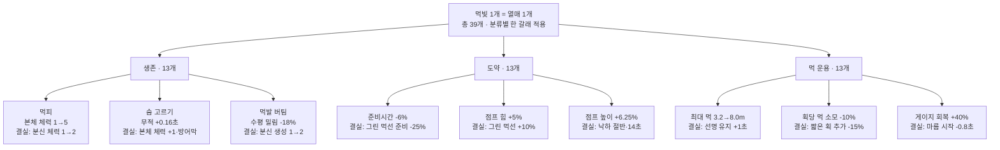
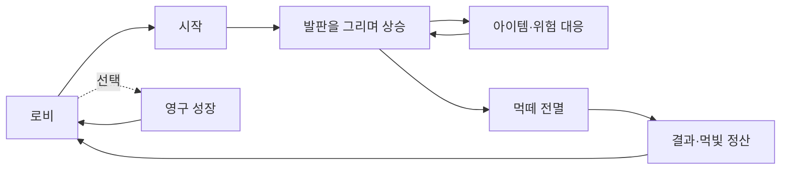

# 먹점프 (MukJump)

> **선 하나가 발판이 되고, 발판 하나가 그림이 된다.**

먹점프는 자동으로 뛰는 작은 먹방울을 위해 직접 발판을 그리는 **세로형 수묵 드로잉 클라이밍 게임**입니다.
캐릭터를 조종하는 대신 붓 한 획의 위치·기울기·길이로 다음 점프를 설계하고, 먹떼를 모아 더 높은 산수화 세계에 도전합니다.

`Unity 6000.3.10f1` · `URP 2D` · `Android` · `9:16 Portrait`

NHN NAN 2026 Game × AI Hackathon · Team-Swooord

## 게임 한눈에 보기

| 항목 | 설명 |
|---|---|
| 장르 | 캐주얼 아케이드 · 드로잉 플랫포머 · 반복 도전 |
| 목표 | 먹방울을 최대한 높이 올려 최고 고도를 갱신하기 |
| 핵심 조작 | 화면에 선을 그어 임시 발판 만들기 |
| 캐릭터 | 약 1초 주기로 자동 점프하며 직접 이동 조작은 하지 않음 |
| 점수 | 한 번의 도전에서 도달한 최고 높이 |
| 성장 | 도전 결과로 얻은 먹빛을 사용하는 **영구 성장 먹나무** |
| 아트 방향 | 한지, 먹 번짐, 갈필과 제한된 낙관색을 사용한 한국 수묵화 스타일 |

## 플레이 방법

1. 로비에서 `시작`을 누르면 먹방울이 자동으로 점프합니다.
2. 착지할 위치를 예상해 화면에 손가락으로 선을 그립니다.
3. 발판의 **기울기**는 점프 방향을, **길이**는 점프 힘을 바꿉니다.
4. 화면에 남길 수 있는 최대 먹 용량을 관리하며 다음 발판을 이어 그립니다.
5. 장애물과 바람을 넘고 살아 있는 먹방울을 지키며 최고 고도를 갱신합니다.

**관찰 → 한 획 그리기 → 자동 점프 → 아이템·위험 대응 → 더 높은 곳에 다시 그리기**

### 조작

| 상황 | 조작 |
|---|---|
| 발판 생성 | 플레이 영역을 누른 채 드래그한 뒤 손을 떼기 |
| 메뉴·성장 선택 | 원하는 버튼 또는 성장 노드를 탭하기 |
| 일시정지 | 플레이 화면 오른쪽 위의 쉼 버튼 탭하기 |
| 재도전 | 결과 화면을 확인한 뒤 로비에서 다시 시작하기 |

> 먹방울의 좌우 이동이나 점프 버튼은 없습니다. **어디에 어떤 선을 그을지**가 곧 조작입니다.
> 최초 접속에서는 로비 입력을 기다리지 않고 게임 화면으로 바로 진입한 뒤, 월드를
> 완전히 멈춘 5단계 한지 팝업으로 먹 그리기·발판·체력·바람·맵 규칙을 먼저 익힙니다.
> 마지막 `시작하기`를 누른 뒤에만 먹방울이 움직이며, 같은 안내는 옵션에서 언제든
> 다시 볼 수 있습니다.

## 핵심 시스템

### 그린 선이 실제 발판이 됩니다

- 입력한 선은 부드럽게 정리된 뒤 갈필 질감과 충돌 판정을 가진 발판으로 완성됩니다.
- 대각선 발판에도 몸이 맞춰 붙으며, 표면 방향에 따라 다음 점프 궤적이 달라집니다.
- 그린 발판은 3.4초 동안 선명하게 남고 이후 1.1초 동안 처음 그린 쪽부터 먹이
  마르듯 사라집니다. 처음 최대 먹 용량은 실전 발판 약 한 획인 3.2m이며, 이를 넘겨도
  가장 먼저 그린 획의 시작점부터 시각과 충돌 판정이 함께 천천히 지워집니다.
- 하단 붓획 게이지는 그리는 중인 획까지 포함한 잔량 비율을 실시간으로 보여 주며,
  화면에 남은 먹선의 총길이가 줄어드는 만큼 다시 차오릅니다. 영구 성장으로
  최대치가 늘면 숫자 없이 트랙 폭도 함께 길어집니다. 옅은 전체 트랙은 최대 용량을
  계속 보여 주고, 불투명한 먹 채움은 사용할수록 왼쪽부터 줄어들며 먹이 돌아오면
  붓이 있는 오른쪽에서 왼쪽으로 약 0.75초 동안 서서히 다시 차오릅니다.
- 남은 게이지가 비어도 계속 그릴 수 있지만 오래된 길을 잃습니다. 짧고 정확한 획으로
  필요한 발판을 이어 가는 편이 유리합니다.

### 한 마리가 아닌 ‘먹떼’를 살립니다

- `먹분신`은 기본 한 마리를 만듭니다. 생존 성장의 마지막 열매 `먹떼 결실`을
  선택 적용하면 획득 1회당 한 마리가 더 생겨 최대 두 마리를 함께 만듭니다.
- 분신 하나가 죽어도 다른 먹방울이 살아 있으면 도전은 계속됩니다.
- 본체는 기본 내구 1칸으로 시작하고, 영구 성장의 먹피 경로를 열면
  2→3→4→5칸까지 늘어납니다. 분신은 기본 1/1 체력이지만 먹피 경로의 마지막
  `먹피 결실`을 선택 적용하면 2/2가 되며, 각 먹방울 머리 위에 자기 최대치만큼 분리된
  체력 칸으로 표시됩니다.
- 피해를 받을수록 몸 그림은 체력칸마다 조금씩 더 부풀지만 Collider와 점프 물리는
  그대로라 조작 규칙은 바뀌지 않습니다. 실제 체력 피해에는 밝은 순간 플래시와
  붉은 먹 번짐·링·충돌음이 함께 나와 피격 시점을 분명하게 알립니다.
- 화면 아래로 떨어진 먹방울은 방어막이 없으면 체력 1칸을 잃고, 체력이 남았을 때만
  화면 안으로 튀어오릅니다. 마지막 체력까지 소진된 개체는 사망하며, 살아 있는 먹방울이
  하나도 없을 때 해당 도전이 끝납니다.
- 카메라는 본체 여부와 상관없이 가장 높은 생존 먹방울을 따라갑니다. 그 선두가 죽으면
  다음으로 높은 생존 먹방울로 한 번만 부드럽게 재구도합니다. 위험물·맵 진행은 별도로
  먹떼 하위 중앙값을 써 한 분신의 돌출 상승이 난도를 조기 해금하지 않게 합니다.

### 높아질수록 세계와 규칙이 달라집니다

- 첫 30m 동안은 공격 장애물 없이 발판 그리기와 먹분신을 익힙니다.
- 화면 좌우의 보이지 않는 경계에 닿으면 안쪽 중앙으로 큰 폭으로 튀어 나오며,
  높이가 조금씩 다른 강한 트램펄린 반동이 한 번 발생합니다. 같은 벽에 붙어 있는 동안에는 수직 반동을 반복하지
  않아 무한 벽타기가 되지 않습니다. 경계 안쪽 0.95m 먹선 금지 띠도 유지합니다.
- 이후 이동 먹가시, 낙묵석, 어린 동양 용과 먹해태 같은 수묵 장애물이 차례로 등장합니다.
  이동 장애물 간격은 평균 14m이고 낙묵석도 완화된 주기로 등장하며, 기기 화면 폭에
  맞춰 좌우 끝까지 분산되어 중앙에만 위험이 몰리지 않습니다.
  좌·우 벽 중 한쪽의 느낌표와 붉은 먹빛이 깜빡이면 해태가 그 벽의 위에서 아래로
  곧게 내려와 화면 밖까지 지나갑니다. 플레이어나 먹선을 향해 꺾이지 않습니다.
- 풍향은 천천히 바뀌며 캐릭터의 수평 이동에 영향을 줍니다. 때로는 상승기류가 낙하를 잠시 늦춥니다.
- 고도에 따라 산길·능선·먹비 계곡·검은 절벽을 지나 우주와 수묵이 섞인 무한 구간으로 이어집니다.

## 아이템

| 아이템 | 효과 |
|---|---|
| 먹물방울 | 살아 있는 먹떼 전체가 50m 상승하고 상승 중 장애물 피해를 받지 않음 |
| 황금 붓 | 8초 동안 새 획을 그려도 오래된 획이 밀려나지 않음. 게이지 채움만 금빛으로 표시하고 종료 뒤 총량을 한 번에 정산 |
| 먹 방어막 | 장애물 피해 또는 화면 하단 추락을 1회 막음. 보유 중 재획득은 소비하지 않음 |
| 먹분신 | 기본 한 마리 추가. `먹떼 결실` 선택 시 획득 1회 최대 2마리, `먹피 결실` 선택 시 각 분신 체력 2칸. 전체 생존 상한 24마리 |

## 영구 성장

로비의 `성장`에서는 도전 결과로 얻은 먹빛으로 큰 먹나무를 해금합니다. 성장은
`생존 / 도약 / 먹 운용` 세 분류이며, 각 분류는 공통 뿌리 뒤 세 갈래로 나뉩니다.
전체 39개 노드의 비용은 모두 먹빛 1개이고, 각 잔가지 끝에는 일반 봉오리보다 큰
`결실` 열매가 마지막 일반 열매 바로 위에 맺힙니다. 해금 기록은 모두 보존하지만
실제 도전에는 분류마다 선택한 한 갈래만 적용됩니다. 따라서 한 판의 빌드는
`생존 1갈래 + 도약 1갈래 + 먹 운용 1갈래`로 구성되며 공용 뿌리는 항상 적용됩니다.
이미 산 다른 갈래는 노드를 눌러 무료로 교체할 수 있고, 상단 `노드 초기화`는 구매
노드를 모두 환불하되 누적 거리와 먹빛 수령 기록은 보존합니다.



- 생존: `본체 최대 체력 +1×4(결실: 분신 체력 +1) / 피격 뒤 무적 +0.04초×4(결실: 본체 체력 +1·방어막) / 피격 수평 밀림 -6%×3(결실: 먹분신 생성 최대 +1)`
- 도약: `준비시간 -1.5%×4(결실: 그린 먹선 준비 추가 -25%) / 점프 힘 +1%×5(결실: 그린 먹선 +10%) / 점프 높이 +1.5625%×4(결실: 하단 낙하 50% 완화·14초)`
- 먹 운용: `최대 먹 용량 +37.5%×4(결실: 선명 유지 +1초) / 획당 먹 소모 -2%×5(결실: 짧은 획 추가 -15%) / 게이지 회복 +10%×4(결실: 마름 시작 -0.8초)`

같은 분류의 세 완성값은 동시에 적용되지 않습니다. 생존은 최대 체력형·피격 방어형·
먹떼형, 도약은 빠른 박자형·강한 먹선형·낙하 안전형, 먹 운용은 최대 용량형·절약형·
빠른 순환형 중 하나를 선택합니다. `넓은 벼루 결실`은 선명 시간을 1초 늘리고,
`가는 붓끝 결실`은 1.5m 이하 짧은 획을 추가 15% 절약합니다. `마르는 먹 결실`은
먹선이 0.8초 일찍 마르기 시작하게 합니다. `고른 박자 결실`은 직접 그린 먹선의
다음 준비를 25% 더 줄이고, `돋는 먹발 결실`은 해당 도약 힘을 10% 더합니다.
`높은 먹발 결실`은 마지막 먹방울이 하단에 몰릴 때 14초마다 낙하 속도를 절반으로
낮춥니다. 황금 붓은 용량 제한만 잠시 풀고 자연 소멸은 계속 진행합니다.

정상 도전의 결과 고도는 계정 누적 거리에 합산됩니다. 누적 20m부터 구간별 문턱을
넘을 때마다 먹빛 1개를 받고, 마지막 39번째 먹빛은 누적 3750m에서 얻습니다.
한 판에 여러 문턱을 넘으면 먹빛도 한꺼번에 지급되며 디버그 판은 반영하지 않습니다.

## 한 판의 흐름



## 프로젝트에서 바로 실행하기

### 요구 환경

- Unity **6000.3.10f1**
- Universal Render Pipeline 2D
- Unity Input System
- Android 세로 화면 또는 Unity Game View 9:16

### 실행 순서

1. 저장소를 클론합니다.
2. Unity Hub에서 저장소 루트를 프로젝트로 엽니다.
3. `Assets/Scenes/Main.unity`를 열고 Play를 누릅니다.
4. Game View를 9:16 세로 비율로 맞춥니다.

씬을 다시 재현해야 할 때만 Unity 메뉴의 `MukJump > Build Main Scene`을 실행합니다.

```bash
git clone https://github.com/Team-Swooord/muk-jump.git
```

플레이에 계정이나 API 키는 필요하지 않습니다. 발판의 수묵 표현은 로컬 폴백 스타일러로 동작하므로 네트워크가 없어도 코어 게임을 끝까지 실행할 수 있습니다.

## 기술 특징

- 터치 스트로크 캡처 → Chaikin 스무딩 → 리샘플링 → `EdgeCollider2D` 발판 생성
- 각도·길이·표면 노멀을 사용하는 자동 점프 물리
- 아이템·장애물·먹물 연출을 기능별 오브젝트 풀로 재사용
- 24마리 먹떼의 최고 생존자 카메라, 하위 중앙 진행 기준, 본체 1→5칸·분신 1→2칸 체력, VFX 예산 관리
- Low·Medium·High 모바일 VFX 품질 단계와 성능 저하 시 자동 하향
- `PlayerPrefs` 기반 최고 기록과 영구 성장 저장, 버전 마이그레이션 지원
- API 키 없이 작동하는 로컬 수묵 스타일 폴백

## 저장소 안내

```text
Assets/
├─ Art/                 캐릭터·배경·UI 원본
├─ Editor/              메인 씬 빌더와 에디터 테스트
├─ MukJump/VFX/         공용 VFX·SFX 런타임 자산
├─ Resources/MukJump/   런타임 로드 배경·UI·장애물 자산
├─ Scenes/Main.unity    실행 씬
└─ Scripts/             Core·Player·Drawing·Items·Obstacles·AI

docs/
├─ project-brief.md     전체 게임 기획과 현재 구현 상태
├─ architecture.md      시스템 경계와 생명주기
├─ design/permanent-growth-trait-tree-v3.md
├─ ai-usage-log.md      AI 활용·에셋 출처 기록
└─ VFX/                 모바일 VFX 표준과 실제 적용 내역
```

더 자세한 내용:

- [프로젝트 종합 브리핑](docs/project-brief.md)
- [게임 아키텍처](docs/architecture.md)
- [영구 성장 설계](docs/design/permanent-growth-trait-tree-v3.md)
- [AI 활용 및 외부 에셋 기록](docs/ai-usage-log.md)
- [제출 전 코드 감사](docs/code-audit-2026-07-26.md)

## 개발 상태

코어 루프와 주요 콘텐츠는 구현되어 있으며, 현재 모바일 실기기 기준 UI 가독성·밸런스·성능을 다듬는 제출 전 폴리시 단계입니다. 제출 화면에는 개발용 `DEBUG` 창을 노출하지 않으며 내부 검증 기능은 자동 회귀 테스트로만 사용합니다.

## 팀

**Team-Swooord · 2인 개발**

NHN NAN 2026 Game × AI Hackathon 제출 프로젝트

캐릭터·배경·UI·음원에 사용한 자체 제작 및 외부 에셋의 생성 과정과 라이선스 확인 상태는 [`docs/ai-usage-log.md`](docs/ai-usage-log.md)에 기록합니다.
