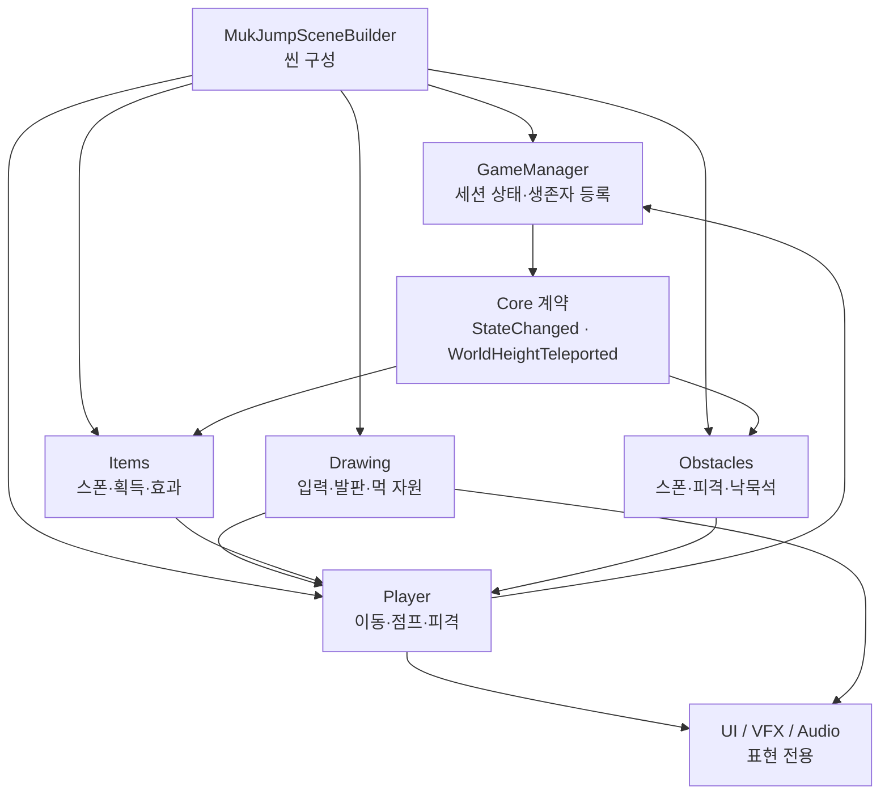

# 먹점프 런타임 아키텍처

이 문서는 기능 하나를 수정했을 때 다른 시스템의 생성·상태·물리가 함께 망가지지 않도록
런타임 책임과 의존 방향을 고정한다. 씬 구성의 단일 진실 공급원은 계속
`Assets/Editor/MukJumpSceneBuilder.cs`이며, 이 문서는 생성된 오브젝트가 플레이 중
어떻게 협력하는지를 설명한다.

## 1. 책임 경계

- `Core`: 게임 상태, 점수, 카메라, 입력 어댑터, 공용 생명주기 계약만 둔다.
- `Player`: 캐릭터 한 마리의 물리와 생존 상태를 소유한다. 스포너를 직접 제어하지 않는다.
- `Drawing`: 스트로크와 발판 수명을 소유한다. 아이템은 공개 메서드를 통해 먹 자원만 바꾼다.
- `Items`, `Obstacles`: 각자 생성한 런타임 객체와 풀을 직접 소유한다.
- UI·VFX·Audio: 게임 규칙을 결정하지 않고 이미 발생한 상태를 표현한다.

`Items`와 `Obstacles`처럼 서로 독립인 기능은 직접 호출하지 않는다. 세션 시작·종료나
디버그 고도 이동처럼 여러 기능이 알아야 하는 사실은 `GameManager`의 이벤트 계약을
통해서만 전달한다. 분신 복제 때 제외할 런타임 표현 캐시도 Core가 구체 아이템 타입을
참조하지 않고 `IRuntimeCloneLifecycle` 계약으로 각 기능에 준비·복원을 위임한다.

## 2. 오브젝트 생명주기

반복 생성되는 객체는 하나의 전역 거대 풀에 넣지 않는다. 기능별 소유자가
`ComponentPool<T>`를 갖고 `IPoolableEntity`의 대여·반납 콜백으로 상태를 초기화한다.
이렇게 해야 아이템 수정이 장애물 풀의 상태를 오염시키지 않는다.

| 소유자 | 재사용 객체 | 보존 상한 | 반납 시점 |
|---|---|---:|---|
| `ItemSpawner` | `ItemPickup` | 8 | 획득, 화면 아래 이탈, 비플레이 상태 |
| `ObstacleSpawner` | `Obstacle` | 10 | 화면 아래 이탈, 비플레이 상태 |
| `FallingInkRockSpawner` | `FallingInkRock` | 2 | 충돌, 소멸, 비플레이 상태 |
| `GameFeedbackController` | 선·방울 피드백 | 활성 포함 선 8 / 방울 16 | 각 짧은 연출 종료 |
| `InkDropJumpVfxPool` | 모든 분신의 먹물점프 합성 VFX | 게임 전체 3 | 3.55초 시퀀스 종료 또는 중단 |
| `GoldenBrushEffectView` | 모든 분신의 황금 붓 표현 | 게임 전체 1묶음(렌더러 24) | 효과 종료 시 숨김 |

풀 규칙은 다음과 같다.

1. 팩토리는 최초 필요 시에만 객체를 만든다.
2. `OnPoolAcquire`에서 이전 물리 속도, 콜라이더, 렌더러, 타이머를 초기화한다.
3. `OnPoolRelease`에서 코루틴을 먼저 멈추고 비활성화한다.
4. 반납은 생성한 기능의 소유자에게 요청하며 다른 시스템이 `Destroy`하지 않는다.
5. 먹물점프 풀은 플레이어 계층 밖에서 모든 분신이 공유해, 분신 수와 무관하게 합성
   오브젝트 총량을 세 묶음으로 제한한다.
6. Play 중 스크립트 재컴파일 뒤 남은 유효한 비활성 객체는 `Adopt`로 새 managed 풀에
   다시 편입하고, 직렬화되지 않는 managed 풀 자체도 즉시 재구성한다.
7. 동시 사망·착지 때 피드백이 몰려도 선 8개와 방울 16개를 넘겨 대여하지 않는다.
   여유 슬롯이 없으면 중요도가 낮은 추가 장식만 생략해 생성·파괴 폭증을 막는다.
8. 황금 붓은 전역 먹 효과이므로 캐릭터마다 표현을 만들지 않고 최고 생존자를 따라가는
   한 묶음만 공유한다.

일반 드로잉 발판은 동시에 최대 4개이고 AI 스타일 변환과 페이드 콜라이더가 한 생명주기로
묶여 있으므로 이번 단계에서는 풀 대상에서 제외한다. 프로파일러에서 발판 생성이 실제
병목으로 확인되면 변환 요청의 세대 토큰까지 포함한 전용 풀로 분리한다.

## 3. 지연 생성

게임 시작 시 보이지 않는 표현 오브젝트는 미리 만들지 않는다.

- 결과 두루마리: 첫 게임오버 `Show`
- 화면 붓 전환: 실제 재시작 전환
- 방어막 자식 효과: 해당 캐릭터가 방어막을 처음 얻을 때
- 공유 황금 붓 효과: 게임에서 황금 붓을 처음 얻을 때
- 먹물점프 합성 VFX: 첫 먹물방울 획득
- 바람·먹비·협곡 선: 해당 고도 구간 첫 진입
- 드로잉 미리보기: 첫 스트로크에서 한 번 만들고 이후 활성 상태만 재사용

이 원칙을 지키면 로비 진입 비용과 실제 플레이 중 기능 비용을 분리할 수 있다.

## 4. 스폰 예약과 순간이동

아이템과 이동 장애물은 다음 생성 고도만 보관한다. 카메라가 급상승하거나 DEBUG 고도
이동이 발생하면 화면 아래의 과거 예약을 실제 생성하지 않고 건너뛴다.
`WorldHeightTeleported`를 받으면 현재 가시 영역을 기준으로 예약을 다시 잡고 활성 객체를
소유 풀에 반납한다.

이 규칙이 없으면 0m에서 750m로 이동할 때 수십~수백 개를 같은 프레임에 생성한 뒤 바로
파괴하게 된다.

## 5. 발판 충돌 정책

- 일반 드로잉 발판: 양방향 `EdgeCollider2D`. 대각선 매달리기와 발판 방향 회전을 유지한다.
- 안전·풍맥 발판: `PlatformEffector2D` 단방향 충돌. 아래에서 위로 통과할 수 있다.
- 특수 효과: 안전 휴식과 풍맥 상승은 위쪽 접촉에서만 발동한다.
- 시각용 검정 외곽선·낙관·바람 문양에는 콜라이더를 추가하지 않는다.

## 6. 변경 시 체크리스트

- 새 반복 객체는 생성자와 제거자를 흩어 두지 말고 한 소유자에 모았는가?
- 풀 객체의 코루틴, 이벤트, 속도, 콜라이더, 렌더러를 반납 시 모두 초기화했는가?
- 세션 상태를 매 프레임 검색하는 대신 기존 이벤트 계약으로 해결할 수 있는가?
- `FindObjectsByType` 결과 배열이나 Material을 매 프레임 새로 만들고 있지 않은가?
- 일반 발판과 특수 발판의 충돌 정책을 함께 바꾸지 않았는가?
- 먹분신 `Instantiate`가 런타임 캐시·풀 자식까지 복제하지 않는가?
- `Assets/Scenes/Main.unity`가 아니라 씬 빌더를 수정했는가?
- 런타임·에디터 어셈블리 컴파일과 관련 회귀 테스트를 통과했는가?
