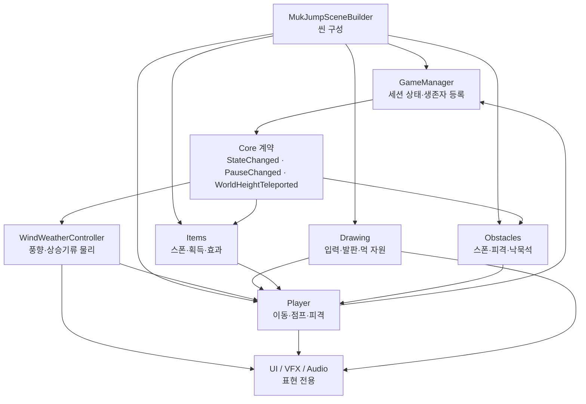

# 먹점프 런타임 아키텍처

이 문서는 기능 하나를 수정했을 때 다른 시스템의 생성·상태·물리가 함께 망가지지 않도록
런타임 책임과 의존 방향을 고정한다. 씬 구성의 단일 진실 공급원은 계속
`Assets/Editor/MukJumpSceneBuilder.cs`이며, 이 문서는 생성된 오브젝트가 플레이 중
어떻게 협력하는지를 설명한다.

## 1. 책임 경계

- `Core`: 게임 상태, 점수, 카메라, 입력 어댑터, 공용 생명주기 계약만 둔다.
- `Player`: 캐릭터 한 마리의 물리와 생존 상태를 소유한다. 스포너를 직접 제어하지 않는다.
- `Drawing`: 스트로크, 총 먹자리 ledger와 FIFO 소멸을 소유한다. 아이템은 공개
  메서드를 통해 판 한정 용량 또는 정산 보류 시간만 바꾼다.
- `Items`, `Obstacles`: 각자 생성한 런타임 객체와 풀을 직접 소유한다.
- UI·VFX·Audio: 게임 규칙을 결정하지 않고 이미 발생한 상태를 표현한다.

`Items`와 `Obstacles`처럼 서로 독립인 기능은 직접 호출하지 않는다. 세션 시작·종료나
디버그 고도 이동처럼 여러 기능이 알아야 하는 사실은 `GameManager`의 이벤트 계약을
통해서만 전달한다. 분신 복제 때 제외할 런타임 표현 캐시도 Core가 구체 아이템 타입을
참조하지 않고 `IRuntimeCloneLifecycle` 계약으로 각 기능에 준비·복원을 위임한다.

현재 이 경계는 폴더·네임스페이스·회귀 테스트로 관리하는 **논리 아키텍처**이며
asmdef로 강제되지는 않는다. `Core` 안의 UI가 일부 Gameplay 타입을 참조하는 현재
의존성을 무시하고 asmdef부터 추가하면 순환 참조가 생긴다. 제출 후에는 다음 방향으로
참조를 단계적으로 끊은 뒤 어셈블리를 도입한다.

`Core.Contracts → Gameplay → Presentation → Bootstrap`

`ArchitectureBoundaryTests`는 그 전까지 런타임의 구형 입력 API, `UnityEditor`, 원격 API
의존과 네임스페이스 이탈을 막는 최소 컴파일 경계 역할을 한다.

## 2. 오브젝트 생명주기

반복 생성되는 객체는 하나의 전역 거대 풀에 넣지 않는다. 기능별 소유자가
`ComponentPool<T>`를 갖고 `IPoolableEntity`의 대여·반납 콜백으로 상태를 초기화한다.
이렇게 해야 아이템 수정이 장애물 풀의 상태를 오염시키지 않는다.

| 소유자 | 재사용 객체 | 보존 상한 | 반납 시점 |
|---|---|---:|---|
| `ItemSpawner` | `ItemPickup` | 8 | 획득, 화면 아래 이탈, 비플레이 상태 |
| `ObstacleSpawner` | `Obstacle` | 10 | 화면 아래 이탈, 비플레이 상태 |
| `ObstacleSpawner` | `HaetaeObstacle` | 2(선행 준비) | 단일 돌진·낙관 소멸 종료, 화면 이탈, 비플레이 상태 |
| `FallingInkRockSpawner` | `FallingInkRock` | 2 | 충돌, 소멸, 비플레이 상태 |
| `GameFeedbackController` | 선·방울 피드백 | 하드 상한 선 8 / 방울 16 | 각 짧은 연출 종료 |
| `InkDropJumpVfxPool` | 모든 분신의 먹물점프 합성 VFX | 게임 전체 하드 상한 3 | 3.55초 시퀀스 종료 또는 중단 |
| `GoldenBrushEffectView` | 모든 분신의 황금 붓 표현 | 게임 전체 1묶음(렌더러 24) | 효과 종료 시 숨김 |
| `DeathInkStainPool` | 죽음 뒤 남는 한지 먹 자국 | 최대 20 | 상한 초과 시 가장 오래된 자국 즉시 재사용 |

`GrowthUnlockPresentation`은 풀 대여 대상이 아니라 `InkUiFeedbackController`가 한 번
미리 만드는 고정 UI 계층이다. 모든 영구 성장 성공 구매가 같은 대각선 먹획,
먹물 파열, 먹고리와 방울 슬롯을 초기화해 재생하며 입력 Raycast를 소유하지 않는다.
모든 노드는 한 번만 해금되므로 1.26초 해금 타임라인 하나만 사용한다.
구매 노드의 `RectTransform` 참조는 보관하지 않고 구매 시점 화면 좌표만 값으로 복사해
고정 계층의 열매 연출 위치로 변환한다. Low·Medium·High는 핵심 먹획·아이콘·제목과
붉은 열매 피어남을 유지하고 장식 방울 수만 줄인다.

풀 규칙은 다음과 같다.

1. 팩토리는 최초 필요 시에만 객체를 만든다.
2. `OnPoolAcquire`에서 이전 물리 속도, 콜라이더, 렌더러, 타이머를 초기화한다.
3. `OnPoolRelease`에서 코루틴을 먼저 멈추고 비활성화한다.
4. 반납은 생성한 기능의 소유자에게 요청하며 다른 시스템이 `Destroy`하지 않는다.
5. 먹물점프 풀은 플레이어 계층 밖에서 모든 분신이 공유해, 분신 수와 무관하게 합성
   오브젝트 총량을 세 묶음으로 제한한다.
6. Play 중 스크립트 재컴파일 뒤 남은 유효한 비활성 객체는 `Adopt`로 새 managed 풀에
   다시 편입하고, 직렬화되지 않는 managed 풀 자체도 즉시 재구성한다.
7. 동시 사망·착지 때 피드백이 몰려도 선 8개와 방울 16개를 넘겨 대여하지 않는다.
   현재 품질의 소프트 예산을 먼저 적용하되 Normal 방울은 최대 10으로 제한해
   `Important` 2개를 남기고, `Important`는 선 7·방울 12,
   `Critical`은 하드 상한까지 예약해 사망·피격·위험 경고의 의미가 사라지지 않게 한다.
8. 황금 붓은 전역 먹 효과이므로 캐릭터마다 표현을 만들지 않고 최고 생존자를 따라가는
   한 묶음만 공유한다.
9. 이동 먹가시와 어린 용은 `ObstacleSpawner`의 같은 예약 슬롯과 풀을 공유한다.
   먹가시는 `CircleCollider2D`, 긴 용은 `CapsuleCollider2D` 하나만 활성화하며 반납
   시 두 판정과 용의 4프레임 애니메이션 상태를 모두 끈다. 프레임 교체는
   `SpriteRenderer.sprite`에만 적용하고 고정 월드 크기의 충돌 판정은 다시 계산하지
   않는다. 한 화면의 용은 최대 한 마리다.
10. 먹해태도 새 고도 슬롯을 만들지 않고 기존 이동 장애물 슬롯을 대체하지만,
    상태·경고·판정이 다른 `HaetaeObstacle` 전용 풀 2개로 격리한다. 카메라 진입
    전 `Hidden`, 낙관 실체화와 경로 고정을 포함한 `Telegraph`, 단발 `Pounce`,
    `Land`, 제자리 낙관 소멸 `SealAway` 상태만 가진다. 경고선 1개·발자국 3개·
    낙관 SpriteRenderer 1개는 풀 인스턴스의 자식으로 선행 생성해 재사용하고,
    본체는 공용 `ObstaclePaperRed` 재질을 공유해 런타임 Material 인스턴스를 늘리지 않는다.
    어린 용과 해태의 활성 합계는 1이다. 해태 첫 320m 보장은 낙묵석·강풍과 겹치면
    소비하지 않으며, 예약 뒤 새 위험이 시작된 경우에도 `HazardConcurrencyGate`가
    낙묵석과 상승기류의 신규 시작을 미룬다. 해태는 실제 예고 순간
    `GameManager.TryGetSwarmAnchor`로 표적을 다시 골라 예약 당시 선두 분신의
    사망·부스트에 끌려가지 않는다. 임시 `PlatformCollider`는 공격만 끝내고 선
    자체는 보존한다.
11. 먹분신은 실제 물리 캐릭터 최대 24마리다. 아이템 한 개마다 `GameManager`가
    정확히 한 마리를 즉시 복제하므로 한 번의 획득에서 대량 `Instantiate`가 발생하지
    않는다. 획득한 캐릭터의 스프라이트·Collider 외곽 바로 옆 좌표를 고르고,
    `InkCloneArrivalView`가 고정 보조 렌더러 하나로 먹 몸통→완성 프레임 팝을
    재생한다. 이 렌더러는 `IRuntimeCloneLifecycle`로 연출 중 재복제 상태를 격리한다.
    분신의 방어막은 모트 4개·파편 6개만 지연 생성하고, 0.14초 안의 동시 사망
    VFX·음원·진동은 한 번으로 합친다.
12. 죽음 먹 자국은 고정 상한 순환 풀이다. 같은 자국을 재대여할 때 세대 토큰을
    바꾸므로 이전 사망 코루틴이 새 자국의 크기를 덮어쓰지 못한다.

일반 드로잉 발판은 시간제 수명과 개수 제한 대신 전역 총 먹자리 ledger를 공유한다.
유효 스무딩 뒤의 실제 길이에 성장 점유 배율을 적용해 비용을 등록하고, 기본 18m를
넘긴 초과분은 FIFO로 가장 오래된 획의 앞부분부터 ledger에서 해제한다. 해당 구간은
기본 1.1초 동안 보이는 먹 스윕과 같은 진행도로 `EdgeCollider2D` 정점을 잘라낸다.
유효하지 않은 획은 ledger와 기존 발판을 바꾸지 않는다. 정상 플레이 제한은 길이이며,
비정상적인 극단적 단획 반복에만 96개 안전 상한을 적용한다. 황금 붓 중에도 이 모바일
안전 상한만은 유지한다. 로컬 스타일 변환과 부분
콜라이더 소멸이 한 생명주기로 묶여 있어 현재는 풀 대상에서 제외한다.

## 3. 지연 생성

게임 시작 시 보이지 않는 표현 오브젝트는 미리 만들지 않는다.

- 결과 두루마리: 첫 게임오버 `Show`
- 화면 붓 전환: 실제 재시작 전환
- 방어막 자식 효과: 해당 캐릭터가 방어막을 처음 얻을 때
- 공유 황금 붓 효과: 게임에서 황금 붓을 처음 얻을 때
- 짧은 공용 피드백: 현재 품질 예산과 Critical 예약 슬롯까지 로비에서 프리웜
- 먹물점프 합성 VFX: 로비 안전 구간에서 현재 단계 상한 1/2/3묶음을 프리웜
- 죽음 먹 자국: 로비에서 최대 20개를 비활성 프리웜하고 이후 가장 오래된 자국 재사용
- 전역 바람선: 첫 플레이 진입
- 먹비·협곡 선: 해당 고도 구간 첫 진입
- 드로잉 미리보기: 첫 스트로크에서 한 번 만들고 이후 활성 상태만 재사용

이 원칙을 지키면 로비 진입 비용과 실제 플레이 중 기능 비용을 분리할 수 있다.

씬 빌더는 사운드 피드백용 `AudioSource` 8개를 미리 만들어 첫 피드백에서
`AddComponent`가 실행되지 않게 한다. 구형 씬을 여는 호환 경로만 런타임 생성을 허용한다.

## 4. VFX 품질·진단

`VfxQualityRuntime`은 수묵 선·방울·고리·날씨·먹물점프 합성 연출의 소프트 예산을
한곳에서 제공한다. 게임 규칙, 충돌, 아이템 효과 지속시간은 품질 단계와 무관하다.

| 단계 | 순간 선 | 순간 방울 | 순간/지속 고리 분할 | 날씨 선 | 먹물점프 동시 합성 | 장식 비율 |
|---|---:|---:|---:|---:|---:|---:|
| Low | 4 | 6 | 20 / 24 | 4 | 1 | 42% |
| Medium | 5 | 10 | 26 / 36 | 7 | 2 | 70% |
| High | 6 | 12 | 32 / 48 | 10 | 3 | 100% |

- 시작 단계는 기기명 화이트리스트가 아니라 시스템 메모리·그래픽 메모리·셰이더
  레벨의 보수적인 권고값으로 정한다. 알 수 없음을 뜻하는 0은 저사양으로 단정하지 않는다.
- `VfxRuntimeMonitor`는 로비·일시정지·게임오버와 앱 복귀 직후를 제외하고 12초 창의
  FPS만 측정한다. 긴 프레임은 0.5초까지만 표본에 포함하되 표본 전체를 버리지 않으며,
  지속 저하 때 한 단계씩만 낮추고 30초 쿨다운을 둔다.
- Android Low Memory 콜백에서는 즉시 Low로 낮춘다. 이미 대여된 먹물점프 합성은
  가장 오래된 장식부터 현재 단계 상한에 맞춰 반납한다.
- 왼쪽 DEBUG 패널의 `VFX` 버튼은 단계 순환과 활성 선·방울·합성, 피크, 생략 수를
  `Auto → Low → Medium → High → Auto`로 순환한다. 통계의 선·방울은 공용 순간
  피드백 풀, 합성은 먹물점프 풀의 범위만 표시한다. Editor 메뉴
  `MukJump > Diagnostics > Audit Mobile VFX`는 현재 URP,
  텍스처 추정 메모리, 생성 씬 렌더러·오디오 개수와 카메라 HDR/MSAA를 읽기 전용으로
  보고한다.
- 생성 씬 카메라는 후처리를 사용하지 않는 2D 수묵 화면에 맞춰 HDR와 MSAA를 끈다.
  URP 에셋, Graphics API, 압축 형식과 Android API 레벨은 실기 비교 없이 자동 변경하지
  않는다.

## 5. 스폰 예약과 순간이동

아이템과 이동 장애물은 시작 월드 Y가 아니라 점수 원점 기준의 다음 생성 고도를 보관한다.
첫 아이템은 12m 먹분신, 첫 공격 장애물은 30m, 첫 어린 용은 60m다. 카메라가 급상승하거나 DEBUG 고도
이동이 발생하면 화면 아래의 과거 예약을 실제 생성하지 않고 건너뛴다.
`WorldHeightTeleported`를 받으면 현재 가시 영역을 기준으로 예약을 다시 잡고 활성 객체를
소유 풀에 반납한다.

상승기류도 다음 발생 고도 하나만 보관한다. 디버그 고도 이동에서는 지나온 이벤트를
연속 발동하지 않고 이동한 고도부터 220~340m 뒤로 다시 예약한다. 풍향·기류 물리는
`WindWeatherController`, 월드 붓결 선은 `WindWeatherView`, 상단 표시는
`WindIndicatorView`가 각각 소유한다.

이 규칙이 없으면 0m에서 750m로 이동할 때 수십~수백 개를 같은 프레임에 생성한 뒤 바로
파괴하게 된다.

풍맥 발판 간격은 직렬화 값이 0·음수·역순·NaN·Infinity여도 최소 양수 범위로
정규화한다. 과거 예약을 따라잡는 생성도 프레임당 8개로 제한하고 제한을 넘으면 현재
고도 이후로 다시 예약한다. 잘못된 에디터 값이나 큰 순간이동이 `while` 무한 루프와
생성 폭증으로 이어지지 않는 것이 이 경계의 목적이다.

## 6. 결정론적 게임 규칙

게임 규칙에 영향을 주는 난수는 `GameplayRandom`의 세션 seed에서 파생한 독립 스트림을
사용한다.

- `Items`: 아이템 종류·위치·간격
- `Obstacles`: 이동 장애물 위치·속도
- `FallingRocks`: 낙묵석 간격·위치
- `Weather`: 풍향·상승기류 예약
- `Platforms`: 풍맥 발판 위치·폭
- `Player`: 자동 점프 배회 방향

VFX·사운드·사망 먹자국은 게임 결과에 영향을 주지 않으므로 `UnityEngine.Random`을
사용해도 된다. 연출을 추가했을 때 게임 난이도나 스폰 순서가 바뀌지 않는 것이 이
경계의 목적이다. 판이 시작될 때만 새 세션 seed와 세대 번호를 적용하며 일시정지·
화면 전환 중에는 스트림을 다시 만들지 않는다.

## 7. 발판 충돌 정책

- 일반 드로잉 발판: 양방향 `EdgeCollider2D`. 대각선 매달리기와 발판 방향 회전을 유지한다.
- 안전 발판은 생성하지 않는다.
- 풍맥 발판: `PlatformEffector2D` 단방향 충돌. 아래에서 위로 통과할 수 있다.
- 풍맥 상승은 위쪽 접촉에서만 발동한다.
- 시각용 검정 외곽선·바람 문양에는 콜라이더를 추가하지 않는다.

먹분신은 전용 `Player` 레이어를 사용한다. Player↔Player 충돌만 끄고 Player↔Platform,
Player↔Obstacle, Player↔Item 충돌은 유지한다. 분신이 늘 때마다 모든 Collider 쌍을
순회하지 않으므로 캐릭터 수에 따른 O(n²) 설정 비용도 생기지 않는다.
새 분신은 획득한 캐릭터의 스프라이트와 Collider를 합친 외곽 폭에 0.1m 간격을 더한
바로 옆 좌표를 선택하며 Y와 초기 속도는 원본을 유지한다. 획득 위치가 카메라 중앙이면
분신 인덱스로 좌우를 번갈아 선택하고, 화면 가장자리에서는 안쪽을 우선한다.
점수는 가장 높은 생존자를 유지하고 위험물 해금·맵 진행은 높이순 하위 중앙값을
사용한다. 카메라의 부드러운 기준도 같은 중앙값이지만 화면 이탈 방지에는 별도로
상위 75% 지점을 사용한다. 1~3마리는 가장 높은 생존자까지 보호하고, 4마리부터는
단독 이상치를 제외해 한 분신이 나머지 떼를 화면 아래로 밀지 않게 한다. 본체와
분신을 구분하지 않고 살아 있는 개체만 다시 정렬하므로 본체 사망 뒤에도 즉시
남은 먹떼로 구도가 전환된다.
정상 세션의 진행값은 최고 도달 중앙값만 유지해 점프 하강이나 개체 사망으로 구간과
배경이 역주행하지 않는다. DEBUG 고도 이동만 이 최고값을 명시한 목표로 다시 맞춘다.

각 `PlayerController`의 체력은 독립 상태이며 `PlayerHealthBillboard`가 하나의 공유
런타임 스프라이트 캐시로 개체별 막대를 그린다. 막대는 캐릭터 스프라이트 bounds 위에
배치하고 루트 회전의 역회전을 적용해 대각선 착지 중에도 수평을 유지한다. 기본·피격
시트 PPU는 780→735→690으로 낮아져 피해 단계마다 그림만 커지고, Rigidbody와
CircleCollider2D는 변하지 않는다. 드로잉 근접 차단은 확대된 렌더 bounds도 검사한다.

카메라를 따라가는 화면 양옆 벽은 움직이는 static collider가 아니라 독립 kinematic
`Rigidbody2D`를 갖고 `FixedUpdate`에서 `MovePosition`한다. 마찰 0 전용 재질을 사용해
카메라의 수직 이동을 캐릭터에 전달하지 않으며, 직렬화된 소유자 marker로 domain reload
뒤 기존 벽을 다시 찾아 중복 collider 생성을 막는다. 좌우 이동 장애물도 같은 원칙으로
kinematic body와 fixed step 이동을 사용한다.

`CameraFollow`는 매 점프의 최고 정점을 진행도로 저장하지 않는다. 먹떼 중앙 대표가
화면 높이 55%의 균형 추적선에 닿으면 위로 따라가고 하강은 무시한다. 이 값은
과거 34% 선행 구도와 75% 상단 데드존 사이의 중간값이다. 급상승 보정은 점프 줌의
현재 크기가 아닌 기본 orthographic 반높이와 먹떼 상위 75% 지점으로 뷰포트 90%
상한을 계산해, 줌 펄스가 수직 카메라 크리프를 만들거나 상위 분신 무리가 화면 밖으로
사라지지 않게 한다.

## 8. 일시정지와 영구 성장 경계

일시정지는 `GameState.Paused`로 전환하지 않는다. 아이템·장애물·낙묵석 스포너는
`Playing`이 아닌 상태를 세션 종료로 해석해 활성 풀을 반납하기 때문이다.

- `GameManager.PauseReason`은 `None`과 `UserMenu`만 구분한다.
- 게임 규칙의 매 프레임 경계는 `GameManager.IsGameplayTicking`을 사용한다.
- `Time.timeScale = 0`으로 물리·발판 소멸 진행·날씨·스폰 예약을 그 자리에서 보존한다.
- `계속하기`는 이전 시간 값을 복원하고, `로비로`는 붓 전환 뒤 현재 씬을 다시 불러
  세션 객체만 초기화한다. 최고 기록과 영구 성장은 유지한다.

플레이 중 무작위 증강, 성장 두루마리, 선택 카드와 도감은 존재하지 않는다.
`RunGrowthController`는 이름 호환을 유지하되 영구 성장 스냅샷과 판당 패시브 재사용
대기시간만 소유한다.

- `LobbyView`는 씬 빌더가 만든 `시작`·`성장`·`옵션` 버튼만 연결한다.
- `LobbyScreenNavigator`는 `Lobby / PermanentGrowth` 중 하나만 활성화한다.
  옵션은 로비 위 모달이며, 붓 전환 중 연속 탭과 게임 시작은 거부한다.
- `PermanentGrowthCatalog`는 생존·도약·먹 운용 각 13개, 총 39개 stable-ID 노드를
  소유한다. 각 분류는 뿌리 1개 뒤 A/B/C 세 갈래로 나뉘고, 갈래마다 일반 노드
  3개와 비기 1개가 있다. 비용은 모두 먹빛 1개다.
- `PermanentGrowthProfile`은 `schemaVersion=1`, `balanceVersion=6` 저장에서 먹빛,
  소유 node ID, 분류별 장착 비기 하나와 정산 run ID를 소유한다. 45노드 저장의
  제거된 도약 4·5단계는 고유 ID당 먹빛 1개를 환급하고 기존 비기 ID는 보존한다.
  정상 저장은 primary를 먼저 확정한 뒤 backup을 갱신한다. primary가 손상됐거나
  지원 범위 밖의 schema/balance이면 원문을 그대로 둔 읽기 전용 복구 상태로
  진입하고 구매·장착·정산을 거부한다. 사용자가 검증된 backup 복원 또는 2회 확인
  초기화를 선택할 때만 기존 primary를 quarantine에 보존하고 교체한다. v5부터의 고도
  이정표 watermark는 최고 기록 표시 저장과 분리되어 부분 저장 뒤 중복 지급을 막고,
  미완료 backup target과 reset/restore marker는 검증 전 자동 삭제하지 않는다.
- `PermanentGrowthRunSnapshot`은 플레이 시작 순간의 소유 node ID와 장착 비기를
  복사한 불변 계약이다. 플레이어·자동 점프·드로잉·발판은 프로필을 실시간 조회하지
  않고 이 스냅샷만 읽는다.
- 정상 게임오버 정산은 run ID로 멱등성을 보장한다. 첫 정상 게임오버는 1개,
  이후 진행 고도 12m 이상·실제 플레이 20초 이상이면 1개를 지급한다. 최고 기록
  100/250/500/750/1000m 최초 돌파마다 1개를 더한다. 디버그 판과 중도 복귀는 0개다.
- `PermanentGrowthView`는 불투명 한지 전체 화면의 드래그 가능한 먹나무에 39개
  노드를 표시한다. 진한 먹 받침 위에 잠금 봉오리·해금 빨간 열매·선택 먹고리·장착
  금빛 고리를 합성하고, 설명은 고정 `SelectedGrowthAction` 팝업에서만 보여 준다.
  UI 트리는 최초 진입 때 한 번 만들고 이후 리소스와 표현 객체를 재사용한다.
- `LobbyOptionsView`는 로비 전용 4장 가이드, 2열 오디오 카드, 로컬 UID와
  언어·고객센터·계정 연동 목업만 소유한다. 외부 로그인 토큰은 저장하지 않는다.
- `InkUiStyle.ConfigureActionButton()`은 로비 세 메뉴의 전용 그래픽을 건드리지
  않고 화면 흐름을 확정하는 텍스트 버튼에만 공용 붓획을 적용한다.

지속 수치의 합성 순서는 `직렬화 기본값 × 영구 성장 × 환경`이다. 먹 운용 상시 노드는
총 먹자리 +8%, 전역 먹자리 점유 -3%, 짧은 획 점유 -6%, 오래된 획 소멸
+0.20초와 시작 지연 +0.10초를 제공한다. 장착 비기는 용량 +6%, 전역 점유 -5%,
소멸 +0.45초 중 하나다. 도약 상한은 자동 점프 준비 -6%, 기본 점프 힘 +5%,
점프 정점 높이 +6.25%이며 9개 비기는 분류마다 하나만 활성화한다.

## 9. 실패·자원 경계

- 화면 전환 콜백이 예외를 던져도 전환 overlay와 raycast 차단을 해제한다.
- 공유 붓 전환이 이미 실행 중이면 새 화면 요청을 시작하지 않는다. 전환 Canvas의
  투명 전체 화면 blocker 한 장만 레이캐스트를 받아 덮기·드러내기 동안 뒤 UI 탭을
  차단하며, 장식 붓획은 입력을 받지 않는다.
- 풀 factory/acquire/release 콜백 실패 시 손상 객체는 재사용하지 않고 폐기한다.
- `ItemEffect.Apply`는 실제 적용 성공 여부를 반환한다. 사망한 플레이어, 실패한 분신
  생성, 필수 드로잉 시스템 부재처럼 효과가 거부된 경우에만 픽업을 월드에 남기고,
  성공한 경우에만 충돌을 끄고 소유 풀에 반납한다.
- 낙묵석 후보 X는 선두 하나가 아니라 모든 생존 분신까지의 최소거리를 비교해,
  화면 중심 먹떼 위를 안전 위치로 오판하지 않는다.
- 동시 사망 피드백은 0.14초 동안 병합하지만 마지막 목숨은 제한을 우회해 결과창 전에
  사망음·먹 번짐이 반드시 재생된다.
- 런타임에 생성한 `AudioClip`, `Sprite`, `Texture2D`, `Material`,
  `PhysicsMaterial2D`는 소유자가 비활성화·파괴되거나 subsystem이 재시작될 때 명시적으로
  해제한다. 외부 에셋 텍스처는 빌린 참조이므로 파괴하지 않는다.
- Debug 도구는 Editor/Development Build에서만 존재하며, 사용한 세션은 최고 기록을
  저장하지 않는다.
- 로컬 최고 기록은 신뢰 경계가 아닌 `PlayerPrefs` 표시 값이다. 향후 온라인 랭킹을
  추가할 경우 서버 검증 없이 이 값을 권한·보상의 근거로 사용하지 않는다.

## 10. 씬 빌드 경계

메뉴 빌드와 테스트는 `MukJumpSceneBuilder.BuildSceneContents()`를 공유한다. 메뉴
`MukJump > Build Main Scene`만 실제 Main 씬, importer, PlayerSettings와 BuildSettings를
변경할 수 있다. `BuildForTests()`는 저장할 수 없는 preview scene 안에 새 루트만
격리하며 실제 프로젝트 설정과 사용자가 연 씬을 변경하지 않는다.

씬 빌더는 기존 Main UI 값을 읽어 보존하지 않는다. 코드의 상수와 연결이 단일 진실
공급원이다. 따라서 UI를 바꾸려면 Main YAML이나 Inspector가 아니라 빌더를 수정한다.
씬 빌더는 시스템 루트에 `LobbyScreenNavigator`를 정확히 한 개 생성한다.
`GameManager`가 누락된 Navigator를 런타임에 추가하는 경로는 구버전 씬 호환용
폴백일 뿐이며, 저장된 `Main.unity`는 항상 최신 빌더 출력과 일치해야 한다.
로비 버튼은 최고 기록 칸에서 검수한 공통 시각 중심 보정을 사용하며, 세부 값과
가독성·모달 규칙은 `docs/design/lobby-ui-overhaul-2026-07-30.md`를 따른다.
구체적인 버튼 수치는 런타임 `LobbyMenuLayout`이 소유하고 씬 빌더도 이를 참조한다.
실행 중이던 구버전 씬 백업이 복원되면 `LobbyView`가 같은 규칙으로 세 버튼을
재배치하고 누락된 옵션 버튼을 수묵 버튼 복제로 복구한다. 같은 시점에
`LobbyWorldSetup`이 시작 먹선의 콜라이더·길이·LineRenderer를 함께 화면 폭으로
맞추되, 로비 하단 먹방울·먹선은 숨기고 구버전 왕복 이동은 비활성화한다.

## 11. 변경 시 체크리스트

- 새 반복 객체는 생성자와 제거자를 흩어 두지 말고 한 소유자에 모았는가?
- 풀 객체의 코루틴, 이벤트, 속도, 콜라이더, 렌더러를 반납 시 모두 초기화했는가?
- 세션 상태를 매 프레임 검색하는 대신 기존 이벤트 계약으로 해결할 수 있는가?
- 일시정지만을 위해 `GameState`를 바꿔 활성 풀과 스폰 예약을 지우고 있지 않은가?
- `FindObjectsByType` 결과 배열이나 Material을 매 프레임 새로 만들고 있지 않은가?
- 일반 발판과 특수 발판의 충돌 정책을 함께 바꾸지 않았는가?
- 바람 물리가 `gravityScale`이나 발판 접착 상태를 직접 변경하지 않는가?
- 먹분신 `Instantiate`가 런타임 캐시·풀 자식까지 복제하지 않는가?
- 게임 판정 난수에 `UnityEngine.Random`을 사용하지 않았는가?
- Debug 기능을 사용한 기록이 최고 기록으로 저장되지 않는가?
- 런타임 생성 native 자원의 해제 경로가 있는가?
- `Assets/Scenes/Main.unity`가 아니라 씬 빌더를 수정했는가?
- 로비·성장 중 하나만 보이고 붓 전환 중 뒤 UI와 연속 탭이 차단되는가?
- 런타임·에디터 어셈블리 컴파일과 관련 회귀 테스트를 통과했는가?
